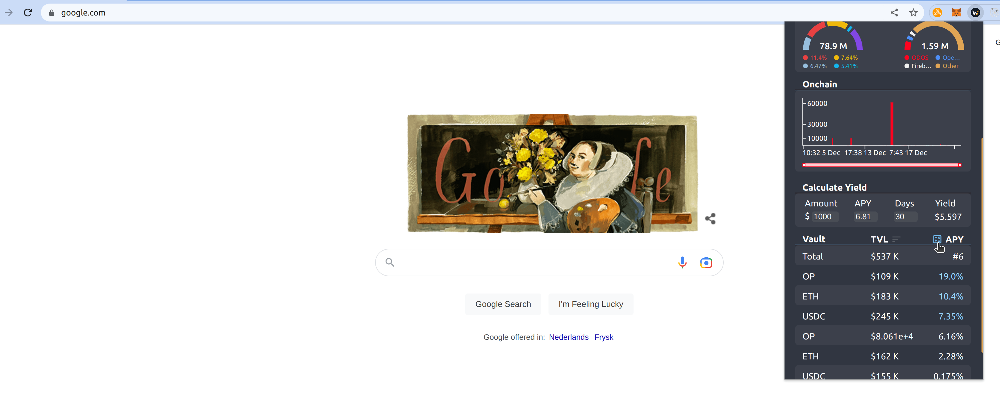

# WOOFi APY Tracker Extension

Display general WOO Network info, APY's and staking amount of WOOFi, and calculate potential Yield rewards.

[WOOFi APY Tracker Extension](https://chrome.google.com/webstore/detail/woofi-apy-tracker-extensi/ebhimcjdodfppheghgcbdfiegcchaplh?hl=en&authuser=0)

## WOOFi-APY-Tracker-Extension

  

  

  

  

// 1. Staked on woox
// 2. Number of woox stakers
// 3. Total woo burned, woo burn wallet
